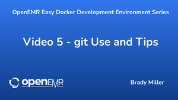
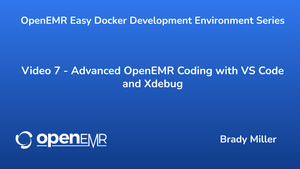
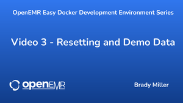
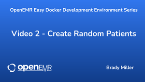

Thank you for your contribution. OpenEMR (and global healthcare) continues to get better because of people like you!

The maintainers of OpenEMR want to get your pull request in as seamlessly as possible, so please ensure your code is consistent with our [development policies](https://open-emr.org/wiki/index.php/Development_Policies).

## Code Contributions (local development)

You will need a "local" version of OpenEMR to make changes to the source code. The easiest way to do this is with [Docker](https://hub.docker.com/r/openemr/openemr/):

---

### Starting with OpenEMR Development Docker Environment
- For the highly recommended free course "You Can Be a OpenEMR Developer in 5 Easy Steps", click below:

    [You Can Be a OpenEMR Developer in 5 Easy Steps](https://www.open-emr.org/blog/you-can-be-a-openemr-developer-in-5-easy-steps/)

- For the Video Tutorial, click below:

    [](https://youtu.be/D4tXP5G9-sY)

- (Recommend using Ubuntu Desktop 22.04 for above video and other videos in the [OpenEMR Easy Docker Development Environment Video Series](https://www.youtube.com/playlist?list=PLFiWG_dDadgQT7zjqvEqbXm1OiuubOVO8). Easiest way to do this is setting up a [Ubuntu Desktop 22.04 Virtual Machine on VirtualBox](https://ubuntu.com/tutorials/how-to-run-ubuntu-desktop-on-a-virtual-machine-using-virtualbox), which recommend configuring with 40GB hard drive, assigning 25% of computer memory, and assigning 25% of cpu cores to the virtual machine.)
  
1. [Create your own fork of OpenEMR](https://github.com/openemr/openemr/fork) (you will need a GitHub account) and `git clone` it to your local machine.

    - For the Video Tutorial, click below:

      [](https://youtu.be/QhTlWMqPV1Q)

      - (Recommend using Ubuntu Desktop 22.04 for above video and other videos in the [OpenEMR Easy Docker Development Environment Video Series](https://www.youtube.com/playlist?list=PLFiWG_dDadgQT7zjqvEqbXm1OiuubOVO8). Easiest way to do this is setting up a [Ubuntu Desktop 22.04 Virtual Machine on VirtualBox](https://ubuntu.com/tutorials/how-to-run-ubuntu-desktop-on-a-virtual-machine-using-virtualbox), which recommend configuring with 40GB hard drive, assigning 25% of computer memory, and assigning 25% of cpu cores to the virtual machine.)

    - If you haven't already, [install git](https://git-scm.com/downloads) for your system
	- (optional) If you want to set up the base services(e.g. git, docker, docker-compose, openemr-cmd, minkube and kubectl) easily, please try [openemr-env-installer](https://github.com/openemr/openemr-devops/tree/master/utilities/openemr-env-installer)
    - (optional) It's best to also add an `upstream` origin to keep your local fork up to date. [Check out this guide](https://oneemptymind.wordpress.com/2018/07/11/keeping-a-fork-up-to-date/) for more info.
2. `cd openemr/docker/development-easy` (if you are running this on Raspberry Pi, then instead do `cd openemr/docker/development-easy-arm32` or `cd openemr/docker/development-easy-arm64`)
    - If you haven't already, [install Docker](https://docs.docker.com/install/) and [install compose](https://docs.docker.com/compose/install/) for your system
    - (optional) If you want to troubleshoot with the below steps easier, please also [install openemr-cmd](https://github.com/openemr/openemr-devops/tree/master/utilities/openemr-cmd) for your system
    - (optional) If you want to monitor and easily manage the docker environment, please also [install openemr-monitor](https://github.com/openemr/openemr-devops/tree/master/utilities/openemr-monitor) and [install portainer](https://github.com/openemr/openemr-devops/tree/master/utilities/portainer) for your system
    - (optional) If you want to migrate the running docker environment, please try [openemr-env-migrator](https://github.com/openemr/openemr-devops/tree/master/utilities/openemr-env-migrator)
    - (optional) If you want to set up with orchestration tool, please try [OpenEMR Kubernetes Orchestrations](https://github.com/openemr/openemr-devops/tree/master/kubernetes/minikube)
3. Run `docker-compose up` from your command line
    - When the build is done, you'll see the following message:
    ```sh
    openemr_1  | Love OpenEMR? You can now support the project via the open collective:
    openemr_1  |  > https://opencollective.com/openemr/donate
    openemr_1  |
    openemr_1  | Starting cron daemon!
    openemr_1  | Starting apache!
    ```
4. Navigate to `http://localhost:8300/` or `https://localhost:9300/` to login as `admin`. Password is `pass`.
5. If you wish to connect to the sql database, this docker environment provides the following 2 options:
    - Navigate to `http://localhost:8310/` where you can login into phpMyAdmin.
    - Or you can directly connect to port 8320 via your favorite sql tool (Mysql Workbench etc.).
    - Use `username/user`: openemr, `password`: openemr .
6. Make changes to any files on your local file system. Most changes will appear after a refresh of the page or iFrame you're working on.

    - For the Video Tutorials, click below:

      [](https://youtu.be/XJl7SQGNhpw)

      [](https://youtu.be/0dEYDHWECMI)

      - (Recommend using Ubuntu Desktop 22.04 for above videos and other videos in the [OpenEMR Easy Docker Development Environment Video Series](https://www.youtube.com/playlist?list=PLFiWG_dDadgQT7zjqvEqbXm1OiuubOVO8). Easiest way to do this is setting up a [Ubuntu Desktop 22.04 Virtual Machine on VirtualBox](https://ubuntu.com/tutorials/how-to-run-ubuntu-desktop-on-a-virtual-machine-using-virtualbox), which recommend configuring with 40GB hard drive, assigning 25% of computer memory, and assigning 25% of cpu cores to the virtual machine.)

    - An exception to this is if making changes to styling scripts in interface/themes/. In that case will need to clear web browser cache and run the following command to rebuild the theme files:
      ```sh
      docker exec -i $(docker ps | grep _openemr | cut -f 1 -d " ") sh -c '/root/devtools build-themes'
      ```
7. When you're done, it's best to clean up after yourself with `docker-compose down -v`
    - If you don't want to build from scratch every time, just use `docker-compose down` so your next `docker-compose up` will use the cached volumes.
8. To ensure you are using the most recent dockers, recommend running below set of commands intermittently:
    ```console
    docker pull openemr/openemr:flex
    docker pull mariadb:10.11
    docker pull phpmyadmin/phpmyadmin
    docker pull couchdb
    docker pull openemr/dev-ldap:easy
    ```
9. [Submit a PR](https://github.com/openemr/openemr/compare) from your fork into `openemr/openemr#master`!

We look forward to your contribution...

---

### Advanced Use of OpenEMR Development Docker Environment

The OpenEMR development docker environment has a very rich advanced feature set. See below Index for links to all the cool advanced stuff:

**Index for Advanced Use of OpenEMR Development Docker Environment**

---

1. [Xdebug and profiling](#xdebug)
2. [API development and testing](#api)
3. [Testing other PHP versions](#other_php_versions)
4. [Php syntax checking, psr12 checking, and automated testing](#dev_tools_tests)
5. [Run the entire dev tool suite](#dev_tools_suite)
6. [Run only all the automated tests](#dev_tools_auto)
7. [Resetting OpenEMR and loading demo data](#dev_tools_reset)
8. [Backup and restore OpenEMR data](#dev_tools_backup)
9. [Send/receive snapshots](#dev_tools_send)
10. [Create and add random patient data](#dev_tools_randompatients)
11. [Add multisite bank](#dev_tools_bankmultisite)
12. [Turn on and turn off support for multisite feature in setup.php](#dev_tools_multisite)
13. [List the current multisite](#dev_tools_listmultisite)
14. [Change the database character set and collation](#dev_tools_charset)
15. [Test ssl certificate and force/unforce https](#dev_tools_https)
16. [Place/remove testing sql ssl certificate and testing sql ssl client key/cert](#dev_tools_ssl)
17. [CouchDB integration](#dev_tools_couchdb)
18. [LDAP integration](#dev_tools_ldap)
19. [Test webroot value](#dev_tools_webroot)

---

1. <a name="xdebug"></a>Xdebug and profiling is supported for PHPStorm and VSCode.

    - For the Video Tutorial, click below:

      [](https://youtu.be/XJl7SQGNhpw)

      - (Recommend using Ubuntu Desktop 22.04 for above video and other videos in the [OpenEMR Easy Docker Development Environment Video Series](https://www.youtube.com/playlist?list=PLFiWG_dDadgQT7zjqvEqbXm1OiuubOVO8). Easiest way to do this is setting up a [Ubuntu Desktop 22.04 Virtual Machine on VirtualBox](https://ubuntu.com/tutorials/how-to-run-ubuntu-desktop-on-a-virtual-machine-using-virtualbox), which recommend configuring with 40GB hard drive, assigning 25% of computer memory, and assigning 25% of cpu cores to the virtual machine.)

     - Firefox/Chrome install xdebug helper add on and enable
    - PHPStorm Settings->Language & Frameworks->PHP->Debug
        - Start listening
        - Untoggle "Break at first line in PHP scripts"
        - Untoggle both settings that start with "Force Break at first line..."
        - See [these images for more detail](https://github.com/openemr/openemr-devops/pull/283#issuecomment-779798156)
    - VSCode
        - Listen for XDebug
        - Use this `launch.json` [template](https://github.com/openemr/openemr-devops/issues/285#issuecomment-782899207)
    - Make sure port 9003 is open on your host operating system
    - Profiling output can be found in /tmp directory in the docker. Following will list the profiling output files:
      ```sh
      docker exec -i $(docker ps | grep _openemr | cut -f 1 -d " ") sh -c '/root/devtools list-xdebug-profiles'
      ```
    - To check Xdebug log:
      ```sh
      docker exec -i $(docker ps | grep _openemr | cut -f 1 -d " ") sh -c '/root/devtools xdebug-log'
      ```
2. <a name="api"></a>API development and testing.
    - Swagger is including in OpenEMR to ease API documentation, development, and testing.
    - The following command will update the API documentation (derive documentation from [_rest_routes.inc.php](_rest_routes.inc.php) to [swagger/openemr-api.yaml](swagger/openemr-api.yaml)):
      ```sh
      docker exec -i $(docker ps | grep _openemr | cut -f 1 -d " ") sh -c '/root/devtools build-api-docs'
      ```
    - Can go to Swagger at [https://localhost:9300/swagger](https://localhost:9300/swagger) where it is super easy to test the API:
        - First, click on 'Authorize' button.
        - Then click 'Select All' scopes.
        - Can then do the following from command line to get a client id and secret, which then can copy/paste into the fields:
          ```sh
          docker exec -i $(docker ps | grep _openemr | cut -f 1 -d " ") sh -c '/root/devtools register-oauth2-client'
          ```
        - Then click 'Authorize' button and follow the flow and before you know it, you will be authorized to test the api endpoints!
    - There is also a mechanism to allow use of the above Swagger tool with multisite.
        - Before going to the Swagger gui linked above, run the following command (after running below command, the Swagger gui will then be configured to work with the selected multisite):
          ```sh
          docker exec -i $(docker ps | grep _openemr | cut -f 1 -d " ") sh -c '/root/devtools set-swagger-to-multisite <multisite-name>'
          ```
        - To collect a client id and secret for the selected multisite, can then do:
          ```sh
          docker exec -i $(docker ps | grep _openemr | cut -f 1 -d " ") sh -c '/root/devtools register-oauth2-client <multisite-name>'
          ```
        - When done testing with Swagger on the selected multisite, recommend setting swagger back to the default multisite to avoid changes to the swagger configuration script showing up in your local git repository:
          ```sh
          docker exec -i $(docker ps | grep _openemr | cut -f 1 -d " ") sh -c '/root/devtools set-swagger-to-multisite'
          ```
    - There is also a dev tool to make it easy to test the API on the online OpenEMR demo farm. For example, what if you wanted to test the API at [https://eleven.openemr.io/a/openemr](https://eleven.openemr.io/a/openemr):
        - Go to [https://eleven.openemr.io/a/openemr/swagger](https://eleven.openemr.io/a/openemr/swagger/index.html) and follow the Swagger gui flow above. The following command can be used to get a client id and secret from that online demo:
          ```sh
          docker exec -i $(docker ps | grep _openemr | cut -f 1 -d " ") sh -c '/root/devtools register-oauth2-client-demo https://eleven.openemr.io/a/openemr'
          ```
3. <a name="other_php_versions"></a>Testing other PHP versions.
    - The standard `flex` docker used in the easy development environments is PHP 8.2. This can be modified by changing the image (`image: openemr/openemr:flex`) used in the docker-compose.yml script. To use PHP 8.1, then just need to change it to `image: openemr/openemr:flex-3.17`.
4. <a name="dev_tools_tests"></a>Php syntax checking, psr12 checking, and automated testing.
    - To check PHP error logs:
      ```sh
      docker exec -i $(docker ps | grep _openemr | cut -f 1 -d " ") sh -c '/root/devtools php-log'
      ```
    - To create a report of PSR12 code styling issues (this takes several minutes):
      ```sh
      docker exec -i $(docker ps | grep _openemr | cut -f 1 -d " ") sh -c '/root/devtools psr12-report'
      ```
    - To fix PSR12 code styling issues (this takes several minutes):
      ```sh
      docker exec -i $(docker ps | grep _openemr | cut -f 1 -d " ") sh -c '/root/devtools psr12-fix'
      ```
    - To create a report of theme styling issues:
      ```sh
      docker exec -i $(docker ps | grep _openemr | cut -f 1 -d " ") sh -c '/root/devtools lint-themes-report'
      ```
    - To fix theme styling issues:
      ```sh
      docker exec -i $(docker ps | grep _openemr | cut -f 1 -d " ") sh -c '/root/devtools lint-themes-fix'
      ```
    - To check PHP parsing errors (this takes several minutes):
      ```sh
      docker exec -i $(docker ps | grep _openemr | cut -f 1 -d " ") sh -c '/root/devtools php-parserror'
      ```
    - To run unit testing:
      ```sh
      docker exec -i $(docker ps | grep _openemr | cut -f 1 -d " ") sh -c '/root/devtools unit-test'
      ```
    - To run api testing:
      ```sh
      docker exec -i $(docker ps | grep _openemr | cut -f 1 -d " ") sh -c '/root/devtools api-test'
      ```
    - To run e2e testing:
      ```sh
      docker exec -i $(docker ps | grep _openemr | cut -f 1 -d " ") sh -c '/root/devtools e2e-test'
      ```
    - To run services testing:
      ```sh
      docker exec -i $(docker ps | grep _openemr | cut -f 1 -d " ") sh -c '/root/devtools services-test'
      ```
    - To run fixtures testing:
      ```sh
      docker exec -i $(docker ps | grep _openemr | cut -f 1 -d " ") sh -c '/root/devtools fixtures-test'
      ```
    - To run validators testing:
      ```sh
      docker exec -i $(docker ps | grep _openemr | cut -f 1 -d " ") sh -c '/root/devtools validators-test'
      ```
    - To run controllers testing:
      ```sh
      docker exec -i $(docker ps | grep _openemr | cut -f 1 -d " ") sh -c '/root/devtools controllers-test'
      ```
    - To run common testing:
      ```sh
      docker exec -i $(docker ps | grep _openemr | cut -f 1 -d " ") sh -c '/root/devtools common-test'
      ```
5. <a name="dev_tools_suite"></a>Run the entire dev tool suite (PSR12 fix, lint themes fix, PHP parse error, unit/API/e2e/services/fixtures/validators/controllers/common tests) in one command, run
    ```sh
    docker exec -i $(docker ps | grep _openemr | cut -f 1 -d " ") sh -c '/root/devtools clean-sweep'
    ```
6. <a name="dev_tools_auto"></a>Run only all the automated tests (unit/API/e2e/services/fixtures/validators/controllers/common tests) in one command, run
    ```sh
    docker exec -i $(docker ps | grep _openemr | cut -f 1 -d " ") sh -c '/root/devtools clean-sweep-tests'
    ```
7. <a name="dev_tools_reset"></a>Resetting OpenEMR and loading demo data.
    - For the Video Tutorial, click below:

      [](https://youtu.be/1ch84Ffmky8)

      - (Recommend using Ubuntu Desktop 22.04 for above video and other videos in the [OpenEMR Easy Docker Development Environment Video Series](https://www.youtube.com/playlist?list=PLFiWG_dDadgQT7zjqvEqbXm1OiuubOVO8). Easiest way to do this is setting up a [Ubuntu Desktop 22.04 Virtual Machine on VirtualBox](https://ubuntu.com/tutorials/how-to-run-ubuntu-desktop-on-a-virtual-machine-using-virtualbox), which recommend configuring with 40GB hard drive, assigning 25% of computer memory, and assigning 25% of cpu cores to the virtual machine.)

    - To reset OpenEMR only (then can reinstall manually via setup.php in web browser):
      ```sh
      docker exec -i $(docker ps | grep _openemr | cut -f 1 -d " ") sh -c '/root/devtools dev-reset'
      ```
        - When running setup.php, need to use `mysql` for 'Server Host', `root` for 'Root Password', and `%` for 'User Hostname'.
    - To reset and reinstall OpenEMR:
      ```sh
      docker exec -i $(docker ps | grep _openemr | cut -f 1 -d " ") sh -c '/root/devtools dev-reset-install'
      ```
    - To reset and reinstall OpenEMR with demo data (this includes several users with access controls setup in addition to patient portal logins. [See HERE for those credentials](https://www.open-emr.org/wiki/index.php/Development_Demo#Demo_Credentials).):
      ```sh
      docker exec -i $(docker ps | grep _openemr | cut -f 1 -d " ") sh -c '/root/devtools dev-reset-install-demodata'
      ```
        - hint: this is also a great way to test any changes a developer has made to the sql upgrade stuff (ie. such as sql/5_0_2-to-6_0_0_upgrade.sql)
8. <a name="dev_tools_backup"></a>Backup and restore OpenEMR data (database and data on drive) via snapshots.
    - For the Video Tutorial, click below:

      [](https://youtu.be/n569Lw5I5us)

      - (Recommend using Ubuntu Desktop 22.04 for above video and other videos in the [OpenEMR Easy Docker Development Environment Video Series](https://www.youtube.com/playlist?list=PLFiWG_dDadgQT7zjqvEqbXm1OiuubOVO8). Easiest way to do this is setting up a [Ubuntu Desktop 22.04 Virtual Machine on VirtualBox](https://ubuntu.com/tutorials/how-to-run-ubuntu-desktop-on-a-virtual-machine-using-virtualbox), which recommend configuring with 40GB hard drive, assigning 25% of computer memory, and assigning 25% of cpu cores to the virtual machine.)

     - Create a backup snapshot (using `example` below, but can use any alphanumeric identifier):
      ```sh
      docker exec -i $(docker ps | grep _openemr | cut -f 1 -d " ") sh -c '/root/devtools backup example'
      ```
    - Restore from a snapshot (using `example` below, but can use any alphanumeric identifier)
      ```sh
      docker exec -i $(docker ps | grep _openemr | cut -f 1 -d " ") sh -c '/root/devtools restore example'
      ```
    - To list the snapshots
      ```sh
      docker exec -i $(docker ps | grep _openemr | cut -f 1 -d " ") sh -c '/root/devtools list-snapshots'
      ```
9. <a name="dev_tools_send"></a>Send/receive snapshots (via capsules) that are created above in item 8.
    - For the Video Tutorial, click below:

      [](https://youtu.be/n569Lw5I5us)

      - (Recommend using Ubuntu Desktop 22.04 for above video and other videos in the [OpenEMR Easy Docker Development Environment Video Series](https://www.youtube.com/playlist?list=PLFiWG_dDadgQT7zjqvEqbXm1OiuubOVO8). Easiest way to do this is setting up a [Ubuntu Desktop 22.04 Virtual Machine on VirtualBox](https://ubuntu.com/tutorials/how-to-run-ubuntu-desktop-on-a-virtual-machine-using-virtualbox), which recommend configuring with 40GB hard drive, assigning 25% of computer memory, and assigning 25% of cpu cores to the virtual machine.)

    - Here is how to grab a capsule from the docker, which can then store or share with friends.
        - List the capsules:
          ```sh
          docker exec -i $(docker ps | grep _openemr | cut -f 1 -d " ") sh -c '/root/devtools list-capsules'
          ```
        - Copy the capsule from the docker to your current directory (using `example.tgz` below):
          ```sh
          docker cp $(docker ps | grep _openemr | cut -f 1 -d " "):/snapshots/example.tgz .
          ```
    - Here is how to send a capsule into the docker.
        - Copy the capsule from current directory into the docker (using `example.tgz` below):
          ```sh
          docker cp example.tgz $(docker ps | grep _openemr | cut -f 1 -d " "):/snapshots/
          ```
        - Restore from the new shiny snapshot (using `example` below):
          ```sh
          docker exec -i $(docker ps | grep _openemr | cut -f 1 -d " ") sh -c '/root/devtools restore example'
          ```
        - Ensure run upgrade to ensure will work with current version OpenEMR:
          ```sh
          docker exec -i $(docker ps | grep _openemr | cut -f 1 -d " ") sh -c '/root/devtools upgrade 5.0.2'
          ```
10. <a name="dev_tools_randompatients"></a>Create and add random patient data. This will use synthea to create random patients that are then imported into OpenEMR. You can choose the number of patients. Note that each patient will take several seconds.
    - For the Video Tutorial, click below:

      [](https://youtu.be/cFBFXFm_Psg)

      - (Recommend using Ubuntu Desktop 22.04 for above video and other videos in the [OpenEMR Easy Docker Development Environment Video Series](https://www.youtube.com/playlist?list=PLFiWG_dDadgQT7zjqvEqbXm1OiuubOVO8). Easiest way to do this is setting up a [Ubuntu Desktop 22.04 Virtual Machine on VirtualBox](https://ubuntu.com/tutorials/how-to-run-ubuntu-desktop-on-a-virtual-machine-using-virtualbox), which recommend configuring with 40GB hard drive, assigning 25% of computer memory, and assigning 25% of cpu cores to the virtual machine.)

    - Create and add 100 random patients (defaults to development mode set to true, which is set be default to true; development mode will markedly improve performance by bypassing the import of the ccda document and bypassing the use of the audit_master and audit_details tables and will directly import the new patient data from the ccda. Note this should never be done on sites that already contain real data/use, and it will also turn off the audit log during the import.):
       ```sh
       docker exec -i $(docker ps | grep _openemr | cut -f 1 -d " ") sh -c '/root/devtools import-random-patients 100'
       ```
       or
       ```sh
       docker exec -i $(docker ps | grep _openemr | cut -f 1 -d " ") sh -c '/root/devtools import-random-patients 100 true'
       ```
    - Create and add 100 random patients (with development mode set to false)
       ```sh
       docker exec -i $(docker ps | grep _openemr | cut -f 1 -d " ") sh -c '/root/devtools import-random-patients 100 false'
       ```
11. <a name="dev_tools_bankmultisite"></a>Create a bank of multisites with selected number of multisites that are all labelled from run1..runx. It will clone from the default instance. This can be helpful for testing of multisites and other larger scale testing.
    - Create 5 multisites (will be run1, run2, run3, run4, run5):
      ```sh
      docker exec -i $(docker ps | grep _openemr | cut -f 1 -d " ") sh -c '/root/devtools generate-multisite-bank 5'
      ```
12. <a name="dev_tools_multisite"></a>Turn on and turn off support for multisite feature (to allow setting up multisites in setup.php script).
    - Turn on support for multisite:
      ```sh
      docker exec -i $(docker ps | grep _openemr | cut -f 1 -d " ") sh -c '/root/devtools enable-multisite'
      ```
    - Turn off support for multisite:
      ```sh
      docker exec -i $(docker ps | grep _openemr | cut -f 1 -d " ") sh -c '/root/devtools disable-multisite'
      ```
13. <a name="dev_tools_listmultisite"></a>The available multsites can be listed via following command:
    ```sh
    docker exec -i $(docker ps | grep _openemr | cut -f 1 -d " ") sh -c '/root/devtools list-multisites'
    ```
14. <a name="dev_tools_charset"></a>Change the database character set and collation (character set is the encoding that is used to store data in the database; collation are a set of rules that the database uses to sort the stored data).
    - Best to demonstrate this devtool with examples.
        - Set character set to utf8mb4 and collation to utf8mb4_general_ci (this is default for OpenEMR 6 and higher):
          ```sh
          docker exec -i $(docker ps | grep _openemr | cut -f 1 -d " ") sh -c '/root/devtools change-encoding-collation utf8mb4 utf8mb4_general_ci'
          ```
        - Set character set to utf8mb4 and collation to utf8mb4_unicode_ci:
          ```sh
          docker exec -i $(docker ps | grep _openemr | cut -f 1 -d " ") sh -c '/root/devtools change-encoding-collation utf8mb4 utf8mb4_unicode_ci'
          ```
        - Set character set to utf8mb4 and collation to utf8mb4_vietnamese_ci:
          ```sh
          docker exec -i $(docker ps | grep _openemr | cut -f 1 -d " ") sh -c '/root/devtools change-encoding-collation utf8mb4 utf8mb4_vietnamese_ci'
          ```
        - Set character set to utf8 and collation to utf8_general_ci (this is default for OpenEMR 5 and lower):
          ```sh
          docker exec -i $(docker ps | grep _openemr | cut -f 1 -d " ") sh -c '/root/devtools change-encoding-collation utf8 utf8_general_ci'
          ```
15. <a name="dev_tools_https"></a>Test ssl certificate (to test client based certificates and revert back to default self signed certificate) and force/unforce https.
    - To test client based certificates, create a zip package of the certificate in OpenEMR at Administration->System->Certificates. Then can import this zip package (example `ssl.zip`) into the docker via:
      ```sh
      docker cp ssl.zip $(docker ps | grep _openemr | cut -f 1 -d " "):/certs/
      ```
    - To list the available certificate packages on docker:
      ```sh
      docker exec -i $(docker ps | grep _openemr | cut -f 1 -d " ") sh -c '/root/devtools list-client-certs'
      ```
    - To install and configure a certificate package (example `ssl`):
      ```sh
      docker exec -i $(docker ps | grep _openemr | cut -f 1 -d " ") sh -c '/root/devtools setup-client-cert ssl'
      ```
    - To revert back to selfsigned certicates (ie. revert the changes required for client based certificates):
      ```sh
      docker exec -i $(docker ps | grep _openemr | cut -f 1 -d " ") sh -c '/root/devtools on-self-signed-cert'
      ```
    - To force https in apache script via redirect:
      ```sh
      docker exec -i $(docker ps | grep _openemr | cut -f 1 -d " ") sh -c '/root/devtools force-https'
      ```
    - To revert the changes that forced https in apache script:
      ```sh
      docker exec -i $(docker ps | grep _openemr | cut -f 1 -d " ") sh -c '/root/devtools un-force-https'
      ```
16. <a name="dev_tools_ssl"></a>Place/remove testing sql ssl certificate and testing sql ssl client key/cert.
    - Place the testing sql ssl CA cert:
      ```sh
      docker exec -i $(docker ps | grep _openemr | cut -f 1 -d " ") sh -c '/root/devtools sql-ssl'
      ```
    - Remove the testing sql ssl CA cert:
      ```sh
      docker exec -i $(docker ps | grep _openemr | cut -f 1 -d " ") sh -c '/root/devtools sql-ssl-off'
      ```
    - Place the testing sql ssl CA cert and testing sql ssl client key/cert:
      ```sh
      docker exec -i $(docker ps | grep _openemr | cut -f 1 -d " ") sh -c '/root/devtools sql-ssl-client'
      ```
    - Remove the testing sql ssl CA cert and testing sql ssl client key/cert:
      ```sh
      docker exec -i $(docker ps | grep _openemr | cut -f 1 -d " ") sh -c '/root/devtools sql-ssl-client-off'
      ```
17. <a name="dev_tools_couchdb"></a>CouchDB integration.
    - In OpenEMR, CouchDB is an option for the patients document storage. For this reason, a CouchDB docker is included in this OpenEMR docker development environment. You can visit the CouchDB GUI directly via http://localhost:5984/_utils/ or https://localhost:6984/_utils/ with username `admin` and password `password`. You can configure OpenEMR to use this CouchDB docker for patient document storage in OpenEMR at Administration->Globals->Documents:
        - Document Storage Method->CouchDB
    - After running the following devtools, 'dev-reset', 'dev-install', 'dev-reset-install', 'dev-reset-install-demodata', 'restore-snapshot', then need to restart the couchdb docker via the following command:
        ```sh
        docker restart $(docker ps | grep _couchdb_1 | cut -f 1 -d " ")
        ```
    - Developer tools to place/remove testing couchdb ssl certificate and testing couchdb ssl client key/cert.
        - Place the testing couchdb ssl CA cert:
          ```sh
          docker exec -i $(docker ps | grep _openemr | cut -f 1 -d " ") sh -c '/root/devtools couchdb-ssl'
          ```
        - Remove the testing couchdb ssl CA cert:
          ```sh
          docker exec -i $(docker ps | grep _openemr | cut -f 1 -d " ") sh -c '/root/devtools couchdb-ssl-off'
          ```
        - Place the testing couchdb ssl CA cert and testing couchdb ssl client key/cert:
          ```sh
          docker exec -i $(docker ps | grep _openemr | cut -f 1 -d " ") sh -c '/root/devtools couchdb-ssl-client'
          ```
        - Remove the testing couchdb ssl CA cert and testing couchdb ssl client key/cert:
          ```sh
          docker exec -i $(docker ps | grep _openemr | cut -f 1 -d " ") sh -c '/root/devtools couchdb-ssl-client-off'
          ```
18. <a name="dev_tools_ldap"></a>LDAP integration.
    - In OpenEMR, LDAP is an option for authentication. If this is turned on, then this will be supported for the `admin` user, which will use the following password: `admin`
    - Turn on LDAP:
      ```sh
      docker exec -i $(docker ps | grep _openemr | cut -f 1 -d " ") sh -c '/root/devtools enable-ldap'
      ```
    - Turn off LDAP:
      ```sh
      docker exec -i $(docker ps | grep _openemr | cut -f 1 -d " ") sh -c '/root/devtools disable-ldap'
      ```
    - Developer tools to place/remove testing ldap tls/ssl certificate and testing ldap tls/ssl client key/cert.
        - Place the testing ldap tls/ssl CA cert:
          ```sh
          docker exec -i $(docker ps | grep _openemr | cut -f 1 -d " ") sh -c '/root/devtools ldap-ssl'
          ```
        - Remove the testing ldap tls/ssl CA cert:
          ```sh
          docker exec -i $(docker ps | grep _openemr | cut -f 1 -d " ") sh -c '/root/devtools ldap-ssl-off'
          ```
        - Place the testing ldap tls/ssl CA cert and testing ldap tls/ssl client key/cert:
          ```sh
          docker exec -i $(docker ps | grep _openemr | cut -f 1 -d " ") sh -c '/root/devtools ldap-ssl-client'
          ```
        - Remove the testing ldap tls/ssl CA cert and testing ldap tls/ssl client key/cert:
          ```sh
          docker exec -i $(docker ps | grep _openemr | cut -f 1 -d " ") sh -c '/root/devtools ldap-ssl-client-off'
          ```
19. <a name="dev_tools_webroot"></a>Test webroot value.
    - The default setup of the docker development environments are with a blank webroot, however, it is a good idea to also test with a webroot setting. There is an option to set the webroot to openemr.
    - Note this dev tool requires the use of the openemr-cmd script, which is discussed above and can find instructions to install and use openemr-cmd script at [install openemr-cmd](https://github.com/openemr/openemr-devops/tree/master/utilities/openemr-cmd).
    - Set webroot to blank:
      ```sh
      openemr-cmd change-webroot-blank
      ```
    - Set webroot to `openemr`:
      ```sh
      openemr-cmd change-webroot-openemr
      ```

### Non-docker Use

If you do not want to use Docker, you can always install OpenEMR directly on your local environment. This will require installing additional dependencies for your operating system. For more info see [OpenEMR Development Versions](https://open-emr.org/wiki/index.php/OpenEMR_Installation_Guides#OpenEMR_Development_Versions) on the wiki.

## Financial contributions

We also welcome financial contributions in full transparency on our [open collective](https://opencollective.com/openemr).
Anyone can file an expense. If the expense makes sense for the development of the community, it will be "merged" in the ledger of our open collective by the core contributors and the person who filed the expense will be reimbursed.

## Credits

### Contributors

Thank you to all the people who have already contributed to openemr!
<a href="https://github.com/openemr/openemr/graphs/contributors"></a>

### Backers

Thank you to all our backers! [[Become a backer](https://opencollective.com/openemr#backer)]

<a href="https://opencollective.com/openemr#backers" target="_blank"></a>

### Sponsors

Thank you to all our sponsors! (please ask your company to also support this open source project by [becoming a sponsor](https://opencollective.com/openemr#sponsor))

<a href="https://opencollective.com/openemr/sponsor/0/website" target="_blank"></a>
<a href="https://opencollective.com/openemr/sponsor/1/website" target="_blank"></a>
<a href="https://opencollective.com/openemr/sponsor/2/website" target="_blank"></a>
<a href="https://opencollective.com/openemr/sponsor/3/website" target="_blank"></a>
<a href="https://opencollective.com/openemr/sponsor/4/website" target="_blank"></a>
<a href="https://opencollective.com/openemr/sponsor/5/website" target="_blank"></a>
<a href="https://opencollective.com/openemr/sponsor/6/website" target="_blank"></a>
<a href="https://opencollective.com/openemr/sponsor/7/website" target="_blank"></a>
<a href="https://opencollective.com/openemr/sponsor/8/website" target="_blank"></a>
<a href="https://opencollective.com/openemr/sponsor/9/website" target="_blank"></a>
